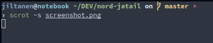

# nord-jatail
[Oh My Zsh](https://github.com/ohmyzsh/ohmyzsh) theme in the [Nord](https://www.nordtheme.com/) color scheme.

To use it clone the repository inside your ohmyzsh folder with the following command:

    git clone https://github.com/jatail/nord-jatail $ZSH/themes/nord-jatail

and then in your `.zshrc` include the line `ZSH_THEME="nord-jatail/nord"`.

This theme is a modified version of [this](https://github.com/fxbrit/nord-extended) which is modified version of [this](https://github.com/TyWR/Nord-zsh) one, many thanks to both. 
